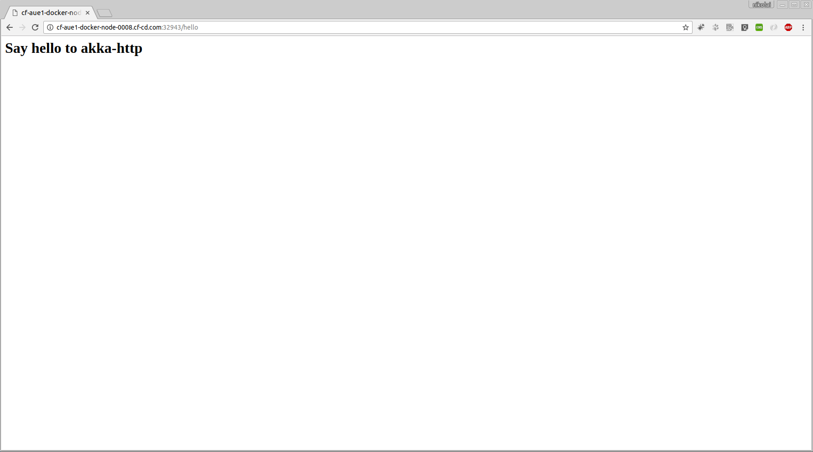

# Welcome

So, you've decided to try Codefresh? Welcome on board!

Using this repository we'll help you get up to speed with basic functionality such as: *compiling*, and *building Docker images*.

This project uses `Scala` to build an application which will eventually become a distributable Docker image.

## Looking around

In the root of this repository you'll find a file named `codefresh.yml`, this is our [build descriptor](https://docs.codefresh.io/docs/what-is-the-codefresh-yaml) and it describes the different steps that comprise our process.
Let's quickly review the contents of this file:


### Building

To bake our application into a Docker image we use Codefresh's [Build step](https://docs.codefresh.io/docs/steps#section-build).

The Build is a simplified abstraction over the Docker build command.

```yml
generate_dockerfile:
    image: noamt/pre-cached-sbt
    working_directory: ${{main_clone}}
    commands:
      - sbt -mem 4096 clean compile package
      - sbt docker:stage

  build_step:
    type: build
    image_name: codefresh/example-scala
    working_directory: ${{main_clone}}/service/target/docker/stage
    dockerfile: Dockerfile
    tag: ${{CF_BRANCH}}
```

Use the `image_name` field to declare the name of the resulting image (don't forget to change the image owner name from `codefreshdemo` to your own!).

### Launching

This is where it gets real! Let's use Codefresh's [Launch Composition step](https://docs.codefresh.io/docs/steps#section-launch-composition) to run our composition within Codefresh!

Launching compositions within Codefresh means you have your very own staging area, at a click of a button!

```yml
launch_composition:
    title: Launch Composition
    type: launch-composition
    composition: docker-compose.yml
    environment_name: 'scala-example'
    entry_point: scala
```

Using the `composition` field, we direct Codefresh to the location if the `docker-compose` file in our repository.

Once the Launch Composition step has completed successfully, you'll be able to review and share your running composition in the [Environments page](https://docs.codefresh.io/docs/share-environment-with-your-test).

Just add the path '/hello' to application url. Something like that http://cf-aue1-docker-node-0008.cf-cd.com:32943/hello

Now that we've gotten a grip on the flow, let's get cracking!

<p align="center">
  
</p>

## Using This Example

To use this example:

* Fork this repository to your own [INSERT_SCM_SYSTEM (git, bitbucket)] account.
* Log in to Codefresh using your [INSERT_SCM_SYSTEM (git, bitbucket)] account.
* Click the `Add Service` button.
* Select the forked repository.
* Select the `I have a Codefresh.yml file` option.
* Complete the wizard.
* Rejoice!

## Using this example locally

This is a simple example of how to create Docker image for a Scala
application.

To build the Docker image, run following commands in sbt
```
> compile
> docker:publishLocal
```

To run the docker image, run following command in terminal
```
$ docker run -p 8080:8080 example/example-service:0.1.0
```

Open [http://localhost:8080/hello](http://localhost:8080/hello) in browser
and you'll see a hello page.
